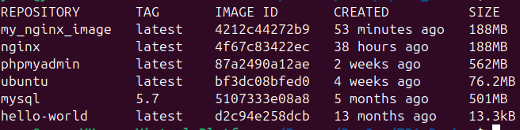

# TP Docker

## Luc Seiler

<!--  -->
<!--  -->

# 4

Création du repository sur l'interface GitHub.


(mettre les commandes git: init, add, commit, push)

# 5.a.

```
docker pull nginx
```


L'image de Nginx est récupérée depuis le hub de Docker.

# 5.b.

```
docker images
```

```
docker ps -a
```


L'image de Nginx est bien installée en local sur la machine.

# 5.c.

```
sudo nano index.html
```

Création du fichier index.html


# 5.d.

Copie du fichier dans le repertoire html/ de Nginx

```
sudo cp index.html ~/nginx/html/index.html
```

Démarrage de l'image sur le port 8080, via un volume

```
docker run --name nginx -v ~/nginx/html:/usr/share/nginx/html:ro -p 8080:80 -d nginx
```


# 6.a.

Arrêt de l'image de Nginx

```
docker stop nginx
```

Création du Dockerfile (fichier 'Dockerfile')


Création d'une nouvelle image custom

```
docker build -t my_nginx_image
```

-t permet de dire que l'on définit un tag pour le conteneur


# 6.b.

Lancement de la nouvelle image Nginx créée avec le Dockerfile

```
docker run --name my_nginx_image -p 8080:80 -d my_nginx_image
```

# 7.a.

```
docker pull phpmyadmin/phpmyadmin
docker pull mysql:5.7
```



Activer les deux conteneurs

```
docker run --name my-mysql -e MYSQL_DATABASE=ynov -e MYSQL_USER=user -e MYSQL_PASSWORD=ynov -e MYSQL_ROOT_PASSWORD=ynov -d mysql:5.7
```

```
docker run --name my-phpmyadmin --link my-mysql:db -e PMA_HOST=my-mysql -e PMA_PORT=3306 -e PMA_USER=user -e PMA_PASSWORD=ynov -p 8081:80 -d phpmyadmin/phpmyadmin
```


# 7.b.

Connexion à l'interface de phpmyadmin


Création de 2 tables, et insertions de données


# 8

Création du fichier `docker-compose.yml` (`docker-compose_pma_mysql.yml`)

<!--  -->

Démarrage des conteneurs via le fichier et docker-compose

```
docker compose up -d
```

-d permet de lancer le conteneur en arrière plan, évitant de prendre le terminal 


Je peux toujours accéder à phpmyadmin, port 8081

# 8.a

Le fichier `docker-compose.yml` permet un meilleur confort de configuration. Il permet de configurer tous les conteneurs en un seul fichier

Il est également pratique si l'on veut donner une certaine configuration à quelqu'un. Il n'aura qu'à récupérer le fichier et taper une seule commande. Cela simplifie donc le déploiement, et évite de faire des erreurs dans les différentes commandes qu'il peut y avoir pour récupérer un conteneur, d'une certaine version, configurer la base de données, l'utilisateur...

Il permet de rendre une configuration plus facile à gérer. Il n'y aura qu'à modifier ce fichier et le renvoyer/réexecuter

# 8.b

On peut rajouter des configurations en plus dans le fichier docker-compose.yml


# 9

# 9.a


