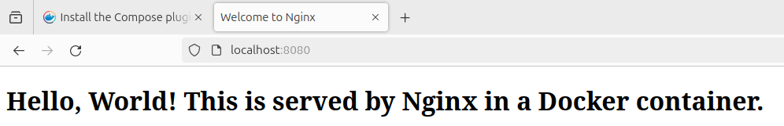

# TP Docker

<!--  -->
<!--  -->

# 4

Création du repository sur l'interface GitHub.


(mettre les commandes git: init, add, commit, push)

# 5.a.

```
docker pull nginx
```


L'image de Nginx est récupérée depuis le hub de Docker.

# 5.b.

```
docker images
```

```
docker ps -a
```


L'image de Nginx est bien installée en local sur la machine.

# 5.c.

```
sudo nano index.html
```

Création du fichier index.html


# 5.d.

Copie du fichier dans le repertoire html/ de Nginx

```
sudo cp index.html ~/nginx/html/index.html
```

Démarrage de l'image sur le port 8080, via un volume

```
docker run --name nginx -v ~/nginx/html:/usr/share/nginx/html:ro -p 8080:80 -d nginx
```




# 5.e.

Arrêt de l'image de Nginx

```
docker stop nginx
```

Création du Dockerfile (fichier 'Dockerfile')


Création d'une nouvelle image custom

```
docker build -t my_nginx_image
```


Lancement de la nouvelle image Nginx créée avec le Dockerfile

```
docker run --name my_nginx_image -p 8080:80 -d my_nginx_image
```